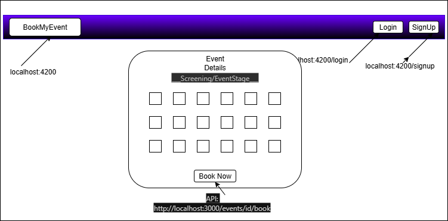
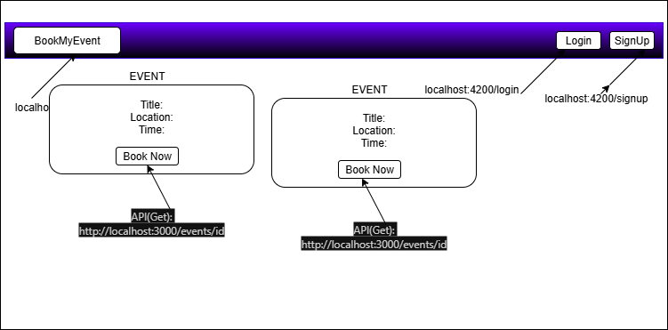
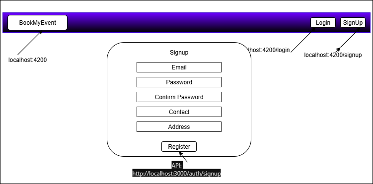
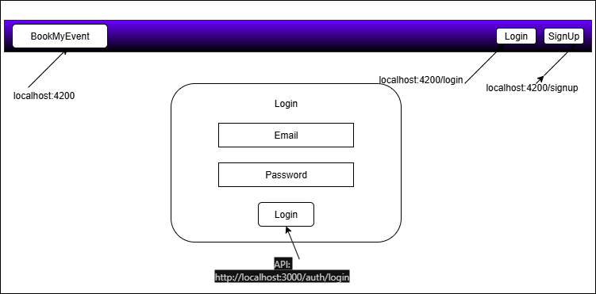
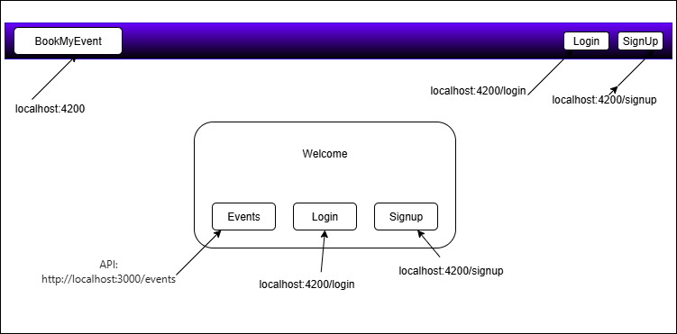
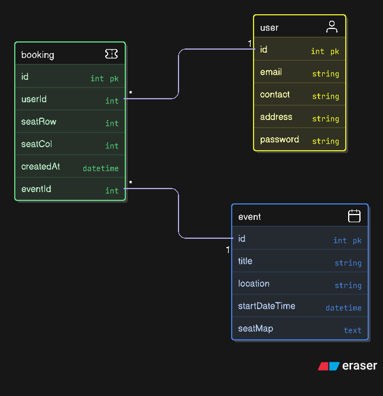

### Project Basic UI Design

 
 
 
 


___________________________________________________________________


## Project Overview Database ERD



___________________________________________________________________

### BookMyEvent- Event Management System

This repository contains a NestJS backend and an Angular frontend for a simple
event booking platform.
___________________________________________________________________


## Quickstart — Run the project (frontend + backend)

This repository contains two apps: a NestJS backend (`/backend`) and an Angular
frontend (`/frontend`).
___________________________________________________________________


### Backend (NestJS)

Requirements: Node 18+, npm, MySQL (or use mock mode described below).

Install and run:

in powershell or CMD
cd backend
npm install
# configure .env or copy .env.example -> .env and update DB_* and JWT_SECRET
npm  start

The backend listens on http://localhost:3000 by default and exposes Swagger docs
at http://localhost:3000/docs.

___________________________________________________________________


### Frontend (Angular)

Requirements: Node 18+, npm, Angular CLI (optional)

Install and run:

in powershell or CMD
cd frontend
npm install
npm run start
# open http://localhost:4200

If you want to run both locally, start the backend first, then the frontend
(frontend expects backend at http://localhost:3000).

___________________________________________________________________


## MySQL setup 

### Option A — Real MySQL (recommended for full features):

1. Install MySQL and create a database (example):

```sql
CREATE DATABASE event_db;


2. Copy `backend/.env.example` to `backend/.env` and set DB_HOST, DB_PORT,
   DB_USER, DB_PASS, DB_NAME and JWT_SECRET.
3. Start the backend; TypeORM will synchronize schema automatically
   (synchronize: true in config). Seed data is created if events table is empty.

___________________________________________________________________


## Design choices & implemented features

- Architecture: Standard Angular frontend + NestJS backend with TypeORM (MySQL).
  Frontend uses standalone components and Angular 17 features.
- Authentication: JWT-based. Backend issues JWT on login and the frontend stores
  it in `sessionStorage` (simple approach for this app). Requests include
  `Authorization: Bearer <token>` via an HTTP interceptor.
- Events & bookings: Events store a `seatMap` (2D string array) serialized as
  `simple-json` in TypeORM; bookings are recorded in a `Booking` entity and the
  seat map is updated to mark seats as booked (`'X'`).
- Validation: Backend uses `class-validator` DTOs for request validation;
  frontend uses Reactive Forms with client-side validators and a
  confirm-password cross-field validator for signup.
- UX: Simple, accessible layouts, toast notifications via Angular Material
  snackbars, and responsive CSS added for common breakpoints.


___________________________________________________________________


### Features implemented

- User signup and login with JWT.
- Event listing and event detail view with seat-selection UI.
- Booking endpoint that atomically updates seat map and persists bookings.
- Basic client-side validation and error messages.
- Responsive styles for common breakpoints (mobile to large desktop).

___________________________________________________________________


### Challenges & notes

- Response envelope: The backend wraps responses in a global response envelope
  (statuscode, data[], message, feildErrors, error). Frontend code currently
  expects this envelope; if you change the backend response format, update
  frontend parsing accordingly.
- Concurrency: Simple seat booking logic updates the seatMap and persists a
  Booking row with a unique constraint. In high-concurrency scenarios, you would
  want more robust locking or transaction handling.
- Security: JWT stored in sessionStorage is convenient for demos but not the
  most secure for production. For production consider HTTP-only cookies or
  stronger token refresh flows.

___________________________________________________________________


## Estimated time spent

- Project coding and initial wiring: 3 hours
- Backend (entities, controllers, auth, TypeORM wiring, seed): 9 hours
- Frontend (components, services, auth flow, events UI): 14 hours
- Responsive CSS and small UI polishing: 3 hours
- Final fixes: 1 hour

Estimated total: 30 hours ![alt text]


(diagram-export-8-19-2025-10_02_49-PM.png)
